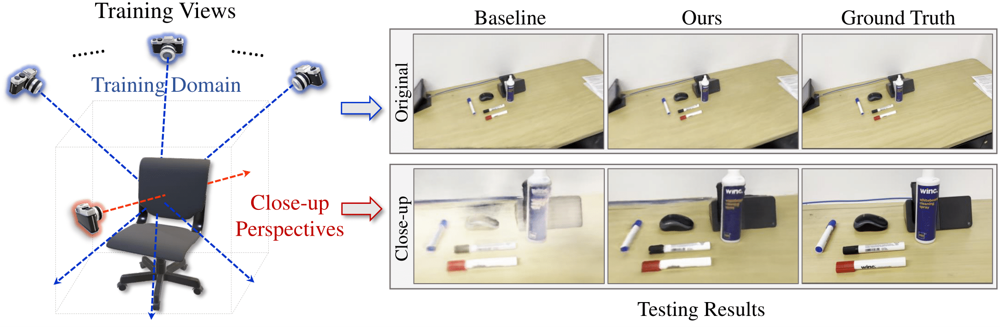
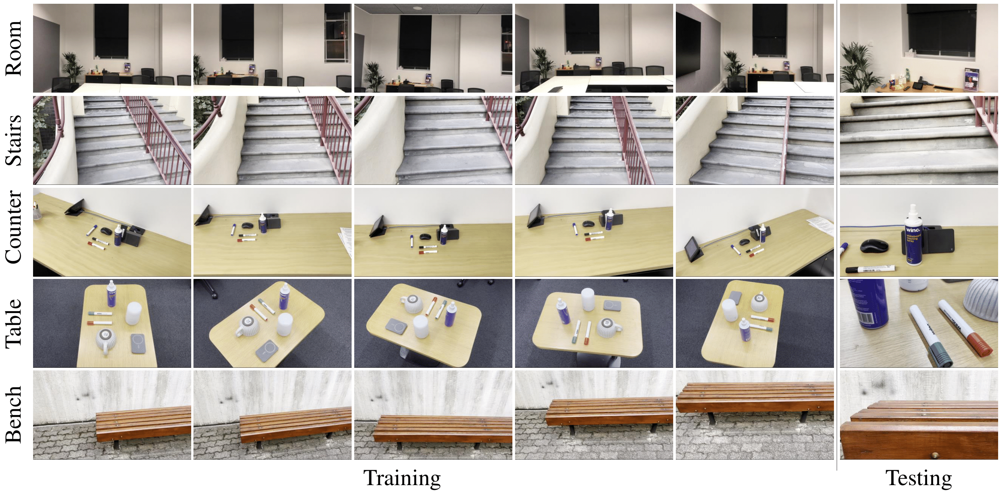

<div align="left">

<h1>Enhancing Close-up Novel View Synthesis via Pseudo-labeling</h1>

**[AAAI 2025]** [Paper Link](https://arxiv.org/abs/2503.15908)  <br>

<p align="center">
  
</p>


This repo contains the official implementation for the paper "Enhancing Close-up Novel View Synthesis via Pseudo-labeling". We investigate novel view synthesis from viewpoints significantly different from those in the training data, particularly focus on diverse close-up perspectives. We introduce a pseudo-label-based learning strategy, significantly enhanced radiance fields in such situation.


</div>

## Installation
```
git clone https://github.com/JiatongXia/Pseudo-Labeling.git
cd Pseudo-Labeling

# Install dependencies
pip install -r requirements.txt
```

## Dataset
We introduce a novel dataset **`close_up_pl`**, to evaluate the generation performance of close-up views that significantly different from those in the training data. You can download our dataset [here](https://drive.google.com/file/d/1tg5KrE6KnRtSG9i4guQ3C5xYbeu3UZJL/view?usp=drive_link).

<p align="center">
  
</p>

Our dataset is organized with the following directory structure:
```
<scene_name>
|---train
|   |---<image 0>
|   |---<image 1>
|   |---...
|---test
|   |---<image 0>
|   |---<image 1>
|   |---...
|---transforms_train.json
|---transforms_test.json
|---transforms_video.json
```
and contains these scenes: `counter` | `table` | `room` | `bench` | `stairs`.

After download the `close_up_pl` dataset, unzip and place it into the `data` folder as follow:
```
├── configs  
│   ├── ...    
│                                                                                      
├── data 
|   ├── close_up_pl
|   |   └── counter
|   |   └── table
|   |   └── room       # downloaded close_up_pl dataset
|   |   └── bench
|   |   └── stairs
```


## Train
To train on the example `counter` dataset:
```
python run_nerf.py --config configs/counter.txt
```
It will create an experiment directory in `./logs`, and store the checkpoints and rendering results there.


## Test and Evaluate
Once you have the checkpoints in the experiment directory, you can
- Render the results:
```
python run_nerf.py --config configs/counter.txt --render_only
```
The video would be stored in the experiment directory.
- Evaluate the results:
```
python eval.py --dir_gt <gt_folder> --dir_pr <result_folder>
```
Replace with the ground truth test images folder path, and the result images folder path.

## Citation
If our work has been beneficial to your research and work, please cite our work using the following format:
```
@article{xia2025pseudo,
  title={Enhancing Close-up Novel View Synthesis via Pseudo-labeling},
  author={Xia, Jiatong and Sun, Libo and Liu, Lingqiao},
  conference={AAAI},
  year={2025}
}
```
